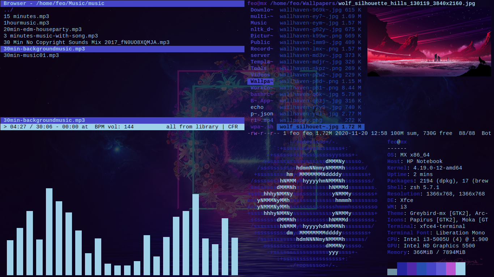

# Linux Rice Config Files

> i3 config path: ~/.config/i3/config

> i3status config path: ~/.config/i3status/config

> init.vim (neovim) config path: ~/.config/nvim/init.vim

> zshrc config path: ~/.zshrc

> wallpaper script path: ~/.wpaper.sh 

> wallpaper folder path: ~/Wallpapers

> qutebrowser config path: ~/.config/qutebrowser/config.py

> xfce4 terminal config path: ~/.config/xfce4/terminal/terminalrc

